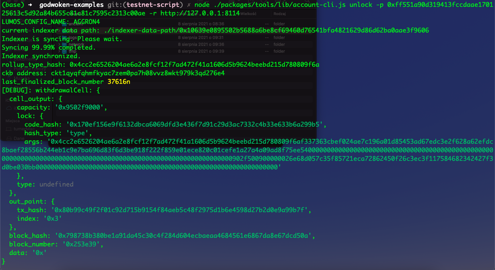
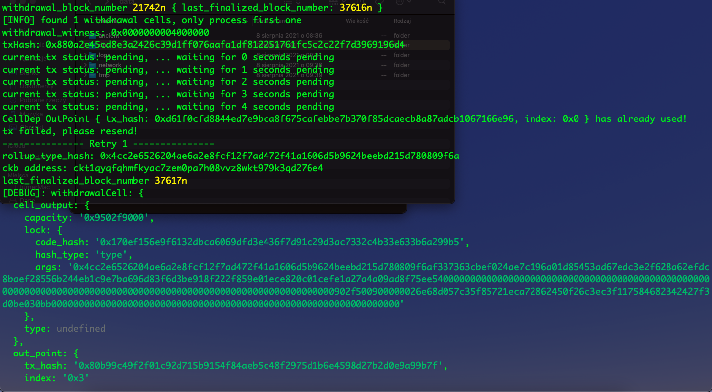
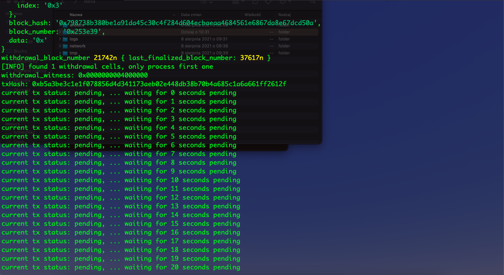
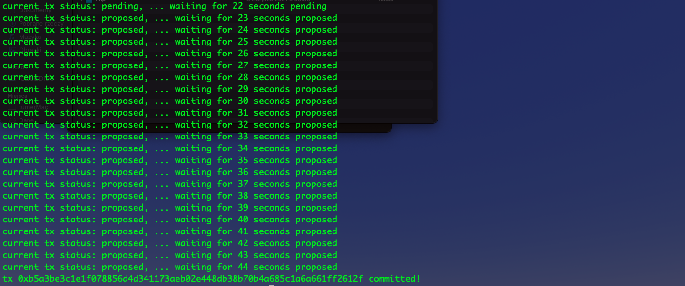

# Gitcoin: 10) Complete Withdrawal Process By Unlocking The Funds
## 1. A screenshot of the console output immediately after running the "unlock" command:







## 2. The Ethereum address that I've used for your Layer 2 account:
```sh
0x60790ABBD7dd61a745Ae937E5ed4812AC3aE737D
```

## 3. The Nervos Layer 1 address associated with the private key passed to "unlock" command:
### Mainnet
```sh
ckb1qyqg87t5gmrytu5r8umspxt78r6t92kgxmlsq0e0vt
```
### Testnet
```sh
ckt1qyqg87t5gmrytu5r8umspxt78r6t92kgxmlsa28sqh
```